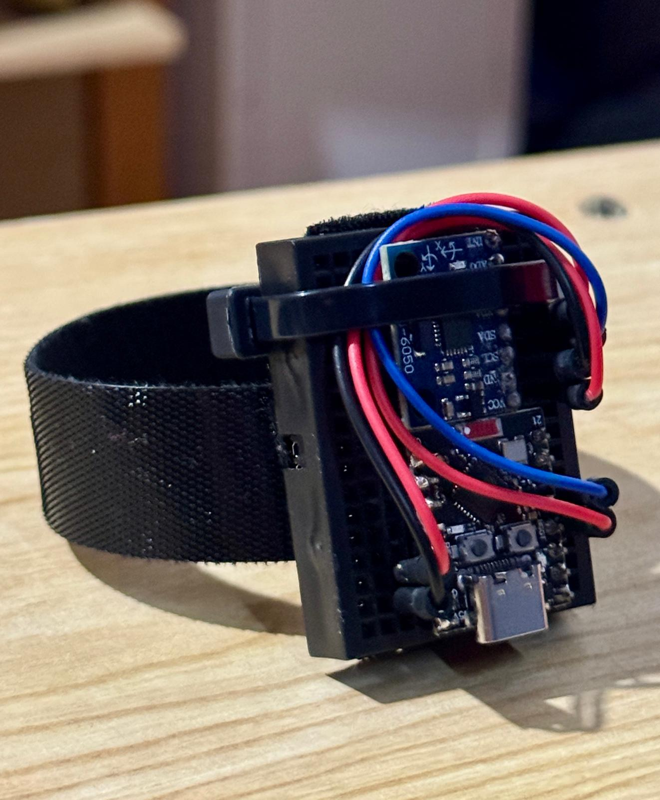
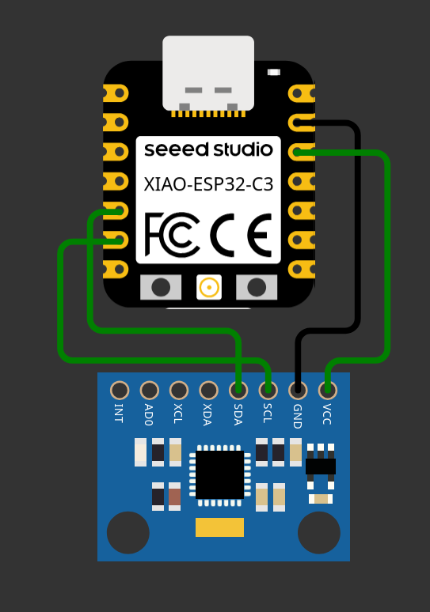
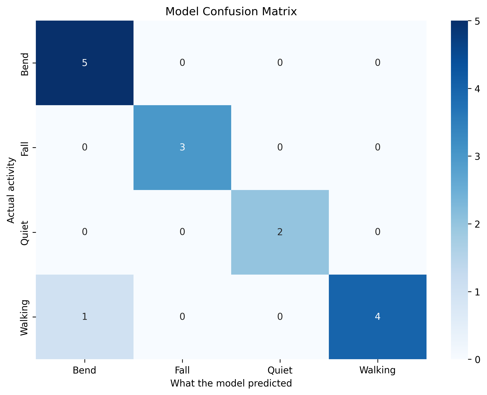

# ⌚ TinyML Fall Detection Wearable

This repository contains the firmware and Machine Learning pipeline for a wearable device capable of classifying human movements and detecting falls in real-time. 

The system runs a **Random Forest** model directly on an **ESP32-C3 Super Mini** microcontroller, processing data from an **MPU6050** accelerometer without needing an internet connection.

## 🚀 Features
* **Edge Classification (Edge AI):** Real-time inference (~45Hz) directly on the ESP32.
* **4 Detected Classes:** `Quiet`, `Walking`, `Bend`, and `Fall`.
* **Efficiency:** Model optimized to pure C++ using `micromlgen`, consuming minimal memory resources.

## 🛠️ Hardware Used
* ESP32-C3 Super Mini
* MPU6050 Accelerometer and Gyroscope Module
* Jumper Wires 

### The Watch (ESP32-C3 Super Mini + MPU-6050)


### Wiring


## 📁 Repository Structure
* `/datos`: Contains raw data in JSON format extracted via Edge Impulse (8+ minutes of movement).
* `notebook.ipynb`: Jupyter Notebook containing feature extraction (1-second overlapping windows), scikit-learn Random Forest training, and evaluation charts.
* `basic_readings.ino`: Auxiliary script for data collection using the Edge Impulse Data Forwarder.
* `/basic_structure`: Contains the main Arduino code (`basic_structure.ino`) and the exported C++ AI model (`Modelo_Movimiento.h`).

## 📊 Model Results
The model was trained by extracting statistical metrics (Mean, Standard Deviation, and Magnitude). 



**Achieved Accuracy:** 93%

## ⚙️ How to Run This Project

1. **Training (Python):**
   ```bash
   pip install -r requirements.txt
   # Run notebook.ipynb to generate a new Modelo_Movimiento.h
